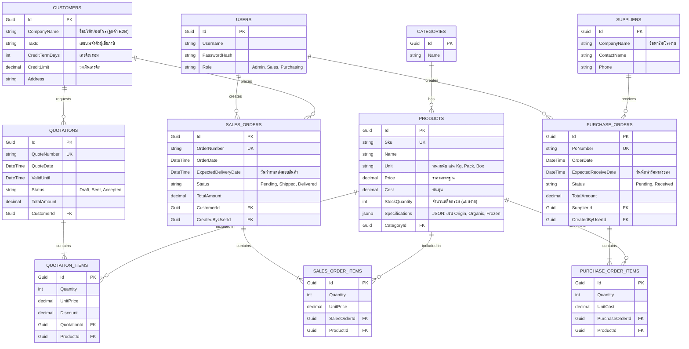

# Database Architecture & ER Diagram
**Database Engine:** PostgreSQL (e.g., Supabase)
**Pattern:** Relational Database with JSONB Support for dynamic specs.

## 📊 ER Diagram (B2B ERP Version)

## 📝 แนวทางการจัดการข้อมูล
1. **Primary Key:** ทุกตารางใช้ UUID/Guid ป้องกันปัญหา ID ชนกันเมื่อระบบขยายตัว
2. **JSONB (Specifications):** ใช้ข้อได้เปรียบของ PostgreSQL ในการเก็บโครงสร้าง Data ที่ไม่มี Schema ตายตัวแบบที่เคยทำใน MongoDB
3. **Data Integrity:** ใช้ Physical Foreign Key (FK) 90% ของระบบ เพื่อความถูกต้องของบัญชีและสต๊อก และจะปลด FK (ใช้ Loose Coupling) เฉพาะกรณีตารางที่ซับซ้อนมากหรือทำ Microservices เท่านั้น
