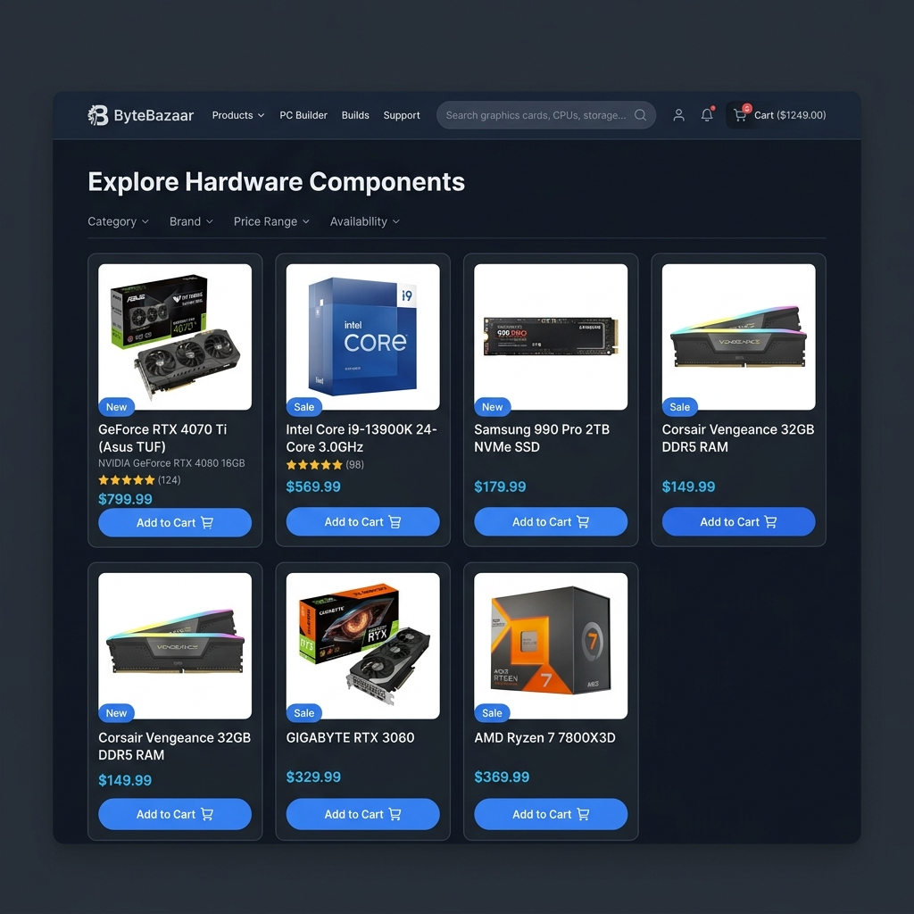
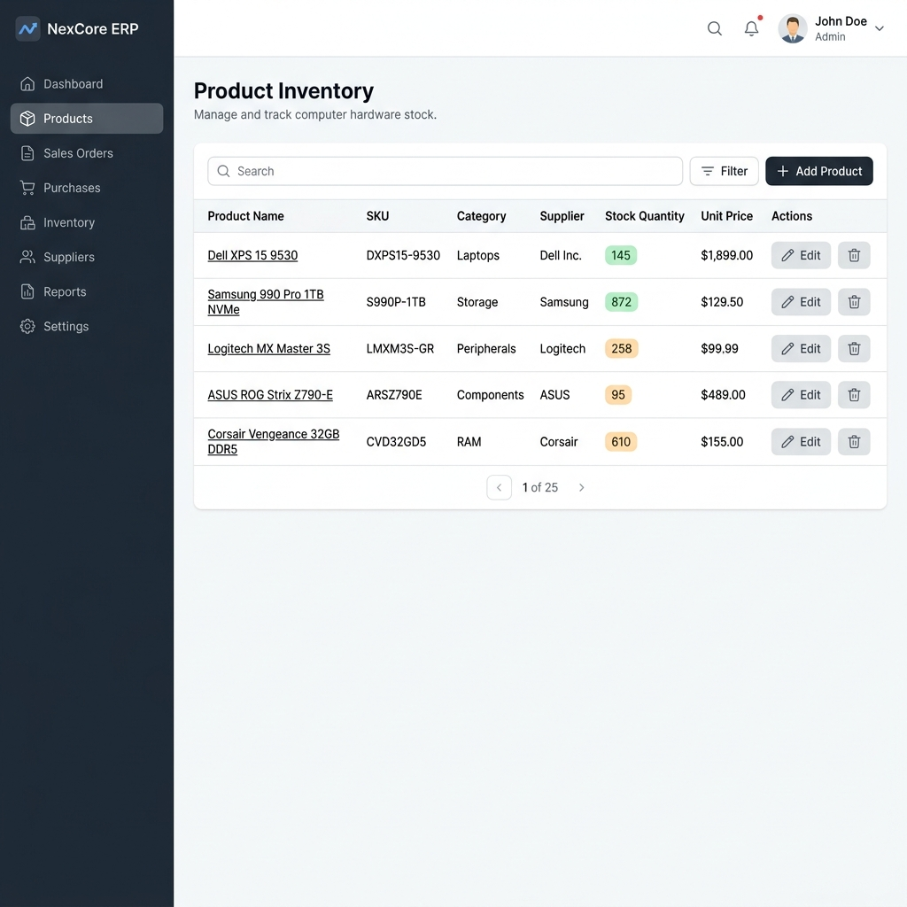

# 🎨 UI Design Concept (แนวทางการออกแบบหน้าเว็บ)

ภาพตัวอย่าง (Mockup) สำหรับเป้าหมายที่เรากำลังจะสร้างด้วย **Angular 18 + Tailwind CSS** ครับ

---

## 🛒 โซน A: Public Storefront (หน้าเว็บให้ลูกค้ากดซื้อของ)

เราจะออกแบบโดยใช้โทนสีเข้ม (Dark Mode) เพื่อความเท่และเข้ากับธีมอุปกรณ์คอมพิวเตอร์/เกมมิ่ง 
ใช้ Grid ธรรมดาในการเรียงการ์ดสินค้า และปุ่ม **Add to Cart** สีน้ำเงินสะดุดตา

**เทคนิค Tailwind ที่จะใช้:**
*   `grid grid-cols-1 md:grid-cols-3 lg:grid-cols-4`: เพื่อทำหน้าเว็บแบบ Responsive (มือถือโชว์แถวละ 1 ชิ้น, จอคอมโชว์แถวละ 4 ชิ้น)
*   `bg-slate-900 text-white`: โทนสีพื้นหลังเข้ม

---

## 👨‍💼 โซน B: Admin / ERP Dashboard (หลังบ้านพนักงาน)

สำหรับหลังบ้าน เราจะใช้โทนสีสว่าง (Light Mode) เพื่อความสบายตาในการอ่านข้อมูลสต๊อกทั้งวัน 
มี **Sidebar** ด้านซ้ายสำหรับสลับเมนู และตรงกลางเป็นตาราง (Table) สำหรับดูจำนวนสต๊อก พร้อมปุ่ม Edit/Delete

**เทคนิค Tailwind ที่จะใช้:**
*   `flex h-screen`: เพื่อแบ่งจอฝั่งซ้าย (Sidebar) ให้ความสูงเต็มจอ และฝั่งขวา (เนื้อหา) ให้เลื่อน Scrollbar ได้อิสระ
*   ตารางใช้คลาส `table-auto w-full text-left` และใช้ `border-b` เพื่อตีเส้นแบ่งบรรทัดให้ดูคลีนๆ
